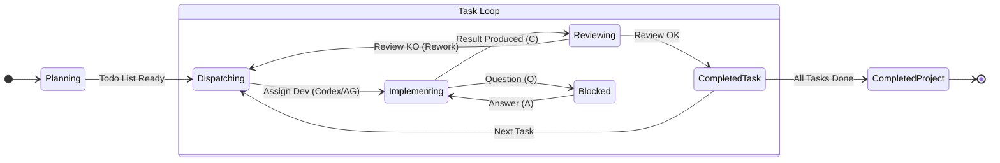

# SPEC — Antidex (Manager + Dev Codex + Dev Antigravity)

## 0) Contexte et objectif

Ce sous-projet (dans `Local_Agents/Antidex/`) vise a **combiner**:
- `Local_Agents/Local_Codex_dual_pipeline/` (orchestration de 2 threads Codex: manager + developer),
- `Local_Agents/Antigravity_POC/` (envoi de prompts a Antigravity via `antigravity-connector` + protocole de sortie par fichiers),
et a s'appuyer sur les briques de `Local_Agents/Local_Codex_appserver/` (client `codex app-server` + UI/browser POC) comme reference.

Le produit final attendu est une **interface web locale** dans laquelle l'utilisateur saisit un prompt (cahier des charges) pour un **agent Manager**. Le Manager:
- fait le plan de travail,
- decoupe en taches (la "taille" cible sera fournie plus tard),
- choisit le bon "developpeur" pour chaque tache: soit **un agent Codex** (developer Codex), soit **Antigravity** (developer AG),
- assigne les taches **une par une** (pipeline sequentiel) et ne passe a la suivante qu'apres verification,
- verifie que c'est bien fait; sinon renvoie un message clair de rework,
- documente ce qui est fait au fur et a mesure,
- met en evidence les deviations/choix pris differents du plan initial,
- gere les tests (et exige des preuves).

### Source de verite
Si ce document diverge d'anciens documents pre-POC (ex: le `.docx` fourni), **les consignes ecrites dans ta demande** priment.

## 1) Roles

### 1.1 Utilisateur
- Fournit le prompt initial (cahier des charges).
- Peut arreter/reprendre un run.
- Observe les sorties et l'etat.

### 1.2 Manager (Codex)
Role central pour garantir que le developpement ne s'arrete pas avant d'etre termine.
- Planification: produit/maintient SPEC/TODO/TESTING_PLAN/DECISIONS + INDEX dans le projet cible.
- Dispatch: choisit le developpeur (Codex vs Antigravity) par tache.
- Verification: relit, lance/valide les tests, demande des corrections si besoin.
- Traçabilite: documente les choix et deviations.
- Auto-correction: si le comportement reel ne suit pas ce qui est prevu (protocoles fichiers, transitions, preuves), il ajuste les instructions des agents (`agents/*.md`) et/ou les conventions par tache, et trace le "pourquoi" dans `doc/DECISIONS.md`.

### 1.3 Developer Codex
Agent Codex dedie a l'implementation de taches de code.
- Lit les instructions et les fichiers de planification.
- Implemente, ajoute des tests, met a jour la doc.
- Produit une sortie "ready for review" via fichier(s) convenus.

### 1.4 Developer Antigravity (AG)
Agent Antigravity dedie aux taches pertinentes pour AG:
- actions via browser (config GitLab/Supabase, creation de cles API, inscriptions, e-mails, etc.),
- tests UI finaux si l'application cible a une UI web,
- taches non triviales de debug/recherche qui beneficient du browser.

AG communique principalement par **fichiers** (protocole `result.json`), et peut modifier le projet cible si l'environnement Antigravity a acces au filesystem du projet.

## 2) Principes clefs (non-negociables)

1) **Pipeline sequentiel**: une tache a la fois, avec verification avant de continuer.
2) **Communication par fichiers**: tout echange important (instructions, taches, resultats, decisions) doit etre ecrit dans des fichiers stables.
3) **Instructions par agent**: chaque agent a un fichier d'instructions; le Manager peut les modifier; a chaque interaction le Manager rappelle:
   - "lis les instructions dans <path>",
   - "ecris ton resultat dans <path> (ou mets a jour <path>)".
4) **Docs comme produit**: le projet doit etre comprehensible via la documentation, a tout moment.
5) **Tests geres par le Manager**: definition, execution/verification, preuve (logs, commandes, resultats).
6) **Deviations explicites**: tout ecart vs plan initial doit etre surligne et explique.
7) **Pilotage utilisateur en cours de run**:
   - L'utilisateur peut consulter a tout moment l'etat du projet via `doc/TODO.md` (doit rester lisible et explicite).
   - L'utilisateur peut modifier `doc/TODO.md` pendant l'execution (ajouter/modifier une demande).
   - Le Manager doit relire `doc/TODO.md` regulierement (au minimum avant chaque dispatch et apres chaque tache) et integrer ces changements (mise a jour plan/taches/docs + decisions si necessaire).
8) **Questions rapides entre agents (clarifications)**:
   - Si necessaire, un agent n'hesite pas a poser des questions (courtes) a l'autre agent, au lieu de produire un long monologue ou de deviner.
   - Les questions/reponses passent par des **fichiers** (voir 4.3) afin de rester tracables et reprise-friendly.
   - Le Manager reste l'arbitre final: il repond directement ou redirige vers l'autre developpeur si besoin.
9) **Remise en question / initiatives des developpeurs (encadrees)**:
   - Les developpeurs (Codex et Antigravity) peuvent remettre en question une instruction du Manager si elle semble incoherente, risquee, ou sous-specifiee.
   - Ils doivent alors poser une question courte (Q/A) au Manager, avec options et recommendation.
   - Ils peuvent aussi prendre une initiative (petite decision locale) pour debloquer l'avancement, MAIS:
     - toute initiative ou deviation doit etre declaree dans le RESULT (`dev_result.*` ou `result.json`) sous une section unique `Ecarts & rationale`,
     - tout changement "significatif" (impact sur comportement/contrat) doit etre trace dans `doc/DECISIONS.md` (ou au minimum propose au Manager).
   - Le Manager doit juger l'initiative:
     - si OK: il l'accepte et met a jour SPEC/TODO/DECISIONS si necessaire,
     - si pas OK: il demande une correction/rework (et le developpeur doit revenir a l'approche demandee).

## 3) Architecture cible (high-level)

### 3.1 Composants (reutilisation des POCs)

- Backend Node (base: `Local_Codex_dual_pipeline/server/`)
  - 1 process `codex app-server` pilote via `CodexAppServerClient` (de `Local_Codex_appserver/server/codexAppServerClient.js`)
  - 2 threads Codex: `managerThreadId` et `codexDeveloperThreadId`
  - 1 client HTTP vers `antigravity-connector` (base: `Antigravity_POC/src/connectorClient.js`)
  - Un orchestrateur de pipeline "3 roles" (Manager + 2 developpeurs)
  - SSE streaming des sorties par role
  - Store d'etat du run (dans le projet orchestrateur) + marqueurs dans le projet cible

- UI web locale (base: `Local_Codex_dual_pipeline/web/`)
  - prompt utilisateur
  - selection du `cwd` cible via un explorateur serveur (`fsApi`)
  - config Manager model / Dev Codex model
  - config Antigravity connector (URL, options)
  - monitoring (etat run + logs par role)

### 3.2 Distinction importante
Il y a:
- **le projet orchestrateur** (ce repo `Antidex/`) qui contient le backend + UI,
- **le projet cible** (un `cwd` choisi) sur lequel les agents travaillent (code+docs).

### 3.3 UI web (orchestrateur) — exigences
L'UI est une **web UI locale** (navigateur) inspiree de `Local_Codex_dual_pipeline/web/`.

Objectifs UI:
- permettre a l'utilisateur de demarrer/piloter un run,
- rendre visible et modifiable l'etat (TODO, taches, proofs),
- permettre de comprendre "ou on en est" sans ouvrir des dizaines de fichiers.

#### 3.3.1 Configuration run
L'UI doit permettre:
- saisir le prompt utilisateur (cahier des charges) pour le Manager,
- choisir le `cwd` cible via un explorateur cote serveur (`fsApi`),
- configurer les modeles:
  - `managerModel`
  - `developerCodexModel`
- configurer Antigravity connector (URL + options):
  - `connectorBaseUrl` (defaut recommande: `http://127.0.0.1:17375`)
  - status panel: afficher `/health` + `/diagnostics` (nb de commandes `antigravity.*`)
  - options avancées (si utiles):
    - timeouts (send/ack/result) et retry policy
    - toggles `notify`/`debug` (quand on envoie via connector) si le connector les supporte

#### 3.3.2 Controle run (Start / Pause / Resume / Stop / Continue / Cancel)
L'UI doit proposer:
- `Start`: cree un nouveau run (bootstrap du `cwd` + lancement du Manager).
- `Pause`: met en pause l'orchestrateur (aucun nouvel agent n'est lance).
  - si un tour Codex est en cours: l'orchestrateur tente `turn/interrupt` (best-effort).
  - si une tache Antigravity est deja envoyee: le run AG peut continuer en arriere-plan; au resume, l'orchestrateur relit les fichiers de resultat (pas de re-send).
- `Resume`: reprend un run en pause.
- `Stop`: arrete la session en cours mais garde l'etat resumable (le run n'est pas "completed").
  - objectif: pouvoir quitter/revenir plus tard sans perdre l'etat, et sans marquer le run comme termine.
- `Continue`: reprend un run "stopped" en recréant une **nouvelle session** pour tous les agents (threads/conversations selon la policy), avec recontextualisation.
- `Cancel`: arrete le run et le marque termine/abandonne (pas de resume; un nouveau run est necessaire).

Important (Resume/Continue et "nouvelle session"):
- Lors d'un `Resume` **et** d'un `Continue`, l'orchestrateur doit produire un **resume packet** et redonner du contexte aux agents.
- Au minimum: l'orchestrateur doit prepend au prompt un resume court qui pointe vers:
  - `agents/<role>.md`
  - `doc/SPEC.md`, `doc/TODO.md`, `doc/TESTING_PLAN.md`, `doc/DECISIONS.md`
  - la tache courante `data/tasks/<task>/...` et les derniers resultats/reviews
- Le resume packet doit aussi contenir un **resume humain court** (10-20 lignes max) incluant:
  - ou on en est (phase + tache courante),
  - ce qui est deja fait (dernier(s) resultats acceptes),
  - ce qui reste a faire ensuite (prochaine tache ou prochain blocage),
  - et les changements detectes dans `doc/TODO.md` depuis la derniere iteration (si applicable).
- Recommande: ecrire le resume packet dans le projet cible pour traçabilite (ex: `data/resume_packets/<runId>/<timestamp>_<role>.md`) et pointer vers ce fichier dans le prompt.
- Recommande: si le resume suit une pause longue, un restart d'app, ou une perte de contexte, l'orchestrateur redemarre les threads (nouvelle session) et utilise le resume packet comme prompt d'amorcage.

#### 3.3.3 Monitoring (etat + logs)
L'UI doit afficher:
- l'etat courant du run (phase, iteration, taskId, assigned developer, statuses),
- les logs en streaming par role (Manager / Dev Codex / Dev AG) via SSE,
- liens pratiques vers les fichiers critiques (pipeline_state, current task dir, last result, last review).
En plus (runs longs / robustesse):
- afficher la "derniere activite" par agent (ex: age mtime heartbeat/ack/result),
- afficher le compteur de retries en cours (ex: "AG tentative 2/3"),
- permettre d'ouvrir `data/recovery_log.jsonl`.

#### 3.3.4 TODO (etat des exigences) — visible + modifiable + diff
L'UI doit:
- afficher `doc/TODO.md` (du projet cible) avec refresh,
- permettre de **modifier** `doc/TODO.md` directement dans l'UI (editor + bouton Save),
- afficher "ce qui a change" via un diff:
  - diff entre la derniere version chargee dans l'UI et la version sur disque,
  - et detecter un changement externe (par ex. hash/mtime different) avec un warning "TODO a change sur disque".

#### 3.3.5 Vue "liste des taches" (data/tasks)
L'UI doit lister `data/tasks/*` (du projet cible) et afficher, pour chaque tache:
- metadata (task id/slug, assigned developer, thread_mode),
- etat derive:
  - presence de `dev_ack.json`, `dev_result.*`, `manager_review.md`,
  - et/ou pointeur `dev_result.json` (AG),
  - statut courant (en cours / blocked / ready_for_review / accepte / rework).
L'UI doit permettre d'ouvrir ces fichiers (viewer) et de naviguer entre eux.

#### 3.3.6 Thread policy (reuse vs new_per_task) — controllable
L'UI doit permettre a l'utilisateur de choisir les valeurs par defaut (pour le run):
- `thread_policy.developer_codex`: `reuse|new_per_task`
- `thread_policy.developer_antigravity`: `reuse|new_per_task`
Note:
- Le Manager garde `reuse` par defaut (un seul thread pour une session de run).
- En cas de `Continue` apres `Stop`/crash/redemarrage, un nouveau thread Manager peut etre necessaire; la continuité est assuree via resume packet.
- Le Manager peut surcharger par tache (dans `task.md` / `pipeline_state.json`), mais l'UI doit rendre visible la policy effective.

## 4) Protocole fichiers (projet cible)

### 4.1 Dossiers/artefacts minimum dans le projet cible
Dans le `cwd` cible, le systeme doit garantir (creer si absent):
- `doc/` avec:
  - `doc/DOCS_RULES.md` (pointeur vers `Local_Agents/doc/DOCS_RULES.md`)
  - `doc/INDEX.md`
  - `doc/SPEC.md`
  - `doc/TODO.md`
  - `doc/TESTING_PLAN.md`
  - `doc/DECISIONS.md`
  - `doc/GIT_WORKFLOW.md` (politique git/github du projet cible)
- `agents/` (instructions par agent):
  - `agents/manager.md`
  - `agents/developer_codex.md`
  - `agents/developer_antigravity.md`
  - `agents/AG_cursorrules.md` (regles generales Antigravity; a lire en permanence)
- `data/` (coordination + preuves):
  - `data/pipeline_state.json` (marqueur runtime/handshake — source de verite pour la reprise)
  - `data/tasks/` (une sous-arborescence par tache)
  - `data/mailbox/` (pointeurs Q/A si besoin)
  - `data/antigravity_runs/` (runs Antigravity: ACK + RESULT + artifacts)
  - `data/AG_internal_reports/` (rapports internes Antigravity: task.md, implementation_plan.md, walkthrough.md, etc.)
  - `data/recovery_log.jsonl` (journal machine-readable des detections/retries watchdog)

Note: les noms exacts des fichiers d'instructions sont a figer (voir "Questions ouvertes").
Note (important): `doc/TODO.md` est le fichier "etat des taches" consultable/modifiable par l'utilisateur pendant le run. Le Manager doit le maintenir a jour et en tenir compte.

### 4.1.1 Schema "sources de verite" (stable vs evolutif)
Objectif: rendre explicite ou se trouve la "verite" a chaque moment du run, et qui est autorise a modifier quoi.

Verite "de base" (contrat courant du projet cible):
- `doc/SPEC.md`: le contrat courant (ce que le systeme doit faire). Evolue si besoin, mais chaque changement important doit etre trace dans `doc/DECISIONS.md`.
- `doc/TODO.md`: etat + exigences courantes (c'est le point d'entree utilisateur en cours de run). Evolue frequemment.
- `doc/TESTING_PLAN.md`: comment verifier (tests + checks). Evolue avec le projet.
- `doc/DECISIONS.md`: pourquoi les ecarts/choix ont ete faits (journal). Evolue au fil de l'eau.
- `doc/INDEX.md`: index navigable des docs. Evolue a chaque ajout/renommage de doc.
- `doc/GIT_WORKFLOW.md`: politique git/github (commit par tache acceptee, setup remote). Evolue rarement.

Verite "d'execution" (par tache):
- `data/tasks/T-xxx_<slug>/...`: source de verite pour la tache courante (instruction, preuves, review, Q/A).

Verite "runtime/handshake" (reprise et transitions):
- `data/pipeline_state.json`: marqueur minimal (etat courant + pointeurs). Ne doit pas contenir de longs contenus; il pointe vers les fichiers canoniques.

Regles d'edition (projet cible):
- Utilisateur: peut modifier `doc/TODO.md` a tout moment.
- Manager: responsable de la coherence globale. Il edite/valide `doc/*`, cree/edite les taches `data/tasks/*`, met a jour `data/pipeline_state.json`, et peut modifier `agents/*.md` si necessaire pour corriger le systeme.
- Developer Codex: implemente le code + tests; ecrit ACK/RESULT; peut proposer/faire des mises a jour de docs si demande (mais le Manager verifie et arbitre).
- Developer Antigravity: ecrit ACK/RESULT via protocole fichiers; peut ajouter des artefacts dans `data/antigravity_runs/.../artifacts/`; peut proposer des mises a jour de docs si necessaire (le Manager arbitre).

Relecture documentation par AG (qualite docs):
- Une fois la documentation de base creee (SPEC/TODO/TESTING_PLAN/DECISIONS/INDEX), le Manager doit planifier au moins une tache "doc review" assignee a `developer_antigravity`:
  - objectif: relire la documentation, signaler les incoherences, proposer des clarifications, et creer des complements si necessaire.
- Apres les modifications d'AG, le Manager doit relire et valider (ou demander corrections) avant de considerer la doc "OK".

### 4.1.2 Instructions des agents (`agents/*.md`) + protocole d'edition (Manager)
Ces fichiers servent a ce que chaque agent sache qui il est, quoi lire, quoi ecrire, et quelles regles respecter.

Fichiers (projet cible):
- `agents/manager.md`
- `agents/developer_codex.md`
- `agents/developer_antigravity.md`
- `agents/AG_cursorrules.md` (regles generales Antigravity)

Format minimal obligatoire (en tete de fichier):
- `role: manager|developer_codex|developer_antigravity`
- `scope: project_cwd`
- `version: <int>` (commence a 1)
- `updated_at: <ISO>`

Structure interne obligatoire:
- `## Base (stable)` (rappels du role, protocole, invariants)
- `## Overrides (manager-controlled)` (consignes ajustables par le Manager pendant le run)

Regles de modification:
- Par defaut, seul le Manager modifie `## Overrides`.
- Auto-correction: si necessaire, le Manager peut aussi modifier `## Base (stable)` (y compris pour d'autres agents) afin de corriger le fonctionnement du systeme.
  - Dans ce cas, il doit:
    - incrementer `version` et mettre a jour `updated_at`,
    - ajouter une entree dans `doc/DECISIONS.md` (quoi/ pourquoi / impact),
    - idealement ajouter un court "CHANGELOG" en tete du fichier (1-3 lignes) ou une note dans la tache courante.

Le fichier `agents/manager.md` doit contenir explicitement le "protocole d'edition" du Manager, au minimum:
- quels fichiers doivent etre maintenus (`doc/*`, `data/pipeline_state.json`, `data/tasks/*`)
- quand les mettre a jour (avant dispatch, apres chaque tache, a chaque deviation, etc.)
- comment exiger les preuves (ACK/RESULT, tests, liste de fichiers modifies)

Origine des fichiers:
- Au demarrage d'un run, l'orchestrateur bootstrape `agents/*.md` dans le projet cible (`cwd`) en copiant des templates depuis le projet orchestrateur Antidex (et en remplacant `updated_at`).
- Le bootstrap est **non destructif**: si `agents/*.md` existent deja, ils ne sont pas ecrases.

### 4.1.3 Lecture forcee des instructions (obligatoire)
Le systeme ne doit pas supposer que les agents "devinent". L'orchestrateur (backend) doit forcer la lecture via un en-tete standard au debut de chaque prompt.

Regle:
- Pour chaque tour (turn) d'un agent, le backend prepend un header "READ FIRST" qui:
  - rappelle le role de l'agent,
  - donne les chemins exacts a lire (`agents/<role>.md`, et pour AG aussi `agents/AG_cursorrules.md`, puis `doc/*`, `data/tasks/...`),
  - donne les chemins exacts a ecrire (ACK/RESULT/Q/A/pipeline_state),
  - rappelle les invariants (docs rules, atomic write, etc.).

Politique "quoi relire quand":
- Nouveau thread (Codex ou Antigravity): relire tout ce que le header liste.
- Thread repris: au minimum verifier la `version` de `agents/<role>.md` (relire si version a change); pour AG verifier aussi `agents/AG_cursorrules.md`; puis relire `task.md` + `manager_instruction.md` pour la tache courante.

### 4.2 `data/pipeline_state.json` (cible) — schema minimal propose
Objectif: reprise d'un run, coordination, et marqueur "Agent On going"/"done".

Champs minimum (proposition):
```json
{
  "run_id": "uuid",
  "iteration": 1,
  "phase": "planning|dispatching|implementing|reviewing|completed|blocked",
  "current_task_id": "T-001_setup",
  "assigned_developer": "developer_codex|developer_antigravity",
  "thread_policy": {
    "manager": "reuse",
    "developer_codex": "reuse|new_per_task",
    "developer_antigravity": "reuse|new_per_task"
  },
  "developer_status": "idle|ongoing|ready_for_review|blocked|failed",
  "manager_decision": "continue|completed|blocked|null",
  "summary": "short",
  "tests": { "ran": true, "passed": false, "notes": "..." },
  "updated_at": "2026-02-15T00:00:00.000Z"
}
```

Regles:
- JSON valide, indente, termine par newline.
- Ce fichier n'est pas un log; c'est un **marqueur** de coordination (mais il doit etre reference dans `doc/INDEX.md` du projet cible).
- Politique "new thread vs resume thread":
  - `thread_policy.manager` est **toujours** `"reuse"`: le Manager garde le meme thread pour tout le projet/run.
  - Pour `developer_codex` et `developer_antigravity`, le Manager peut choisir `"reuse"` ou `"new_per_task"`.
  - Valeur par defaut: `"reuse"` (on ne renouvelle les threads que pour des projets "gros" ou si la qualite se degrade).
  - Pour Antigravity, `"reuse"` correspond a `newConversation=false` et `"new_per_task"` a `newConversation=true` (attention: voir limites en section 7).

### 4.3 Taches + mailboxes (proposition)
Pour rendre la coordination robuste, chaque tache est un **dossier stable**:
- `data/tasks/T-001_<slug>/task.md` (demande + Definition of Done + developpeur assigne + thread_mode + budget de scope)
- `data/tasks/T-001_<slug>/manager_instruction.md` (instruction canonique envoyee au developpeur)
- `data/tasks/T-001_<slug>/dev_ack.json` (B: ACK — "j'ai recu et je commence")
- `data/tasks/T-001_<slug>/dev_result.md` ou `data/tasks/T-001_<slug>/dev_result.json` (C: RESULT — livraison + preuves; ecriture atomique recommandee)
- `data/tasks/T-001_<slug>/manager_review.md` (feedback + accept/rework + deviations)
- `data/tasks/T-001_<slug>/questions/` (questions courtes posees pendant la tache)
- `data/tasks/T-001_<slug>/answers/` (reponses courtes; par defaut par le Manager)

Regle de decoupage (taille des taches):
- Le Manager doit viser des taches ou il estime que le developpeur ecrira **< 700 lignes** (ordre de grandeur) sur la tache.
- Ce critere ne doit pas casser la coherence: le decoupage doit rester logique (pas de micro-taches artificielles).

Definitions (important):
- **B (ACK)**: un marqueur rapide qui confirme la prise en charge (ne prouve pas que c'est fini).
- **C (RESULT)**: la livraison finale de la tache, avec preuves (fichiers modifies, commandes/tests, logs, etc.).
- **Q/A (clarification)**: mini-echanges courts, declenches uniquement si necessaire, pour eviter les hypothese fragiles.
- **Ecarts & rationale**: bloc unique dans le RESULT qui liste les initiatives et deviations (decision + pourquoi + impact + revert).

Convention Q/A (proposee):
- Une question = un fichier `data/tasks/<task>/questions/Q-001.md` contenant:
  - contexte minimal (ou pointeurs vers fichiers)
  - la question
  - 1-3 options proposees (si possible) + recommendation
- Une reponse = un fichier `data/tasks/<task>/answers/A-001.md` contenant:
  - decision/clarification
  - impact sur la tache (ce qu'il faut faire maintenant)
  - eventuelles mises a jour a faire dans `doc/TODO.md` / `doc/SPEC.md` / `doc/DECISIONS.md`

Convention "Ecarts & rationale" (proposee):
- Si le developpeur s'ecarte des instructions (deviation) ou prend une initiative (decision locale) sans validation prealable:
  - il la declare dans le RESULT sous un bloc unique `Ecarts & rationale`:
    - decision prise
    - pourquoi (rationale)
    - impact/risque
    - comment revert si le Manager n'est pas d'accord
- Le Manager doit explicitement accepter/refuser ces ecarts dans `manager_review.md` (et demander un rework si refuse).

Mailboxes (notifications, optionnelles mais recommandees pour simplifier l'orchestrateur):
- `data/mailbox/to_developer_codex/` et `data/mailbox/from_developer_codex/`
- `data/mailbox/to_developer_antigravity/` et `data/mailbox/from_developer_antigravity/`
Chaque notification est un petit JSON "pointer" vers la tache, par ex:
- `data/mailbox/to_developer_codex/T-001.pointer.json` -> `{ "task_id":"T-001", "task_dir":"data/tasks/T-001_<slug>/", "must_read":[...], "updated_at":"<ISO>" }`

Regle d'or: la **source de verite** du contenu est toujours `data/tasks/...` (la mailbox ne contient que des pointeurs).

### 4.4 Runs Antigravity (reutilisation Antigravity_POC)
Pour une tache executee par Antigravity, utiliser le protocole par run:
- `data/antigravity_runs/<runId>/request.md`
- `data/antigravity_runs/<runId>/ack.json` (optionnel mais recommande)
- `data/antigravity_runs/<runId>/result.tmp` -> rename -> `result.json` (atomic write)
- `data/antigravity_runs/<runId>/artifacts/` (captures, exports, etc.)

Le prompt envoye a Antigravity doit inclure explicitement ces chemins et la regle d'ecriture atomique.

### 4.5 Transitions (declencheurs entre agents)
Les agents ne "switchent" pas magiquement entre eux: c'est l'orchestrateur (backend) qui lance le prochain agent en fonction de **marqueurs fichiers**.

Declencheurs proposes:
- **Manager -> Developer**: creation/mise a jour d'un dossier de tache + instruction (`data/tasks/.../manager_instruction.md`) + eventuel pointer mailbox.
- **Developer -> Manager (review)**: presence d'un RESULT valide (`dev_result.*` ou `data/antigravity_runs/.../result.json`) + mise a jour de `data/pipeline_state.json` (`developer_status=ready_for_review`).
- **Developer -> Manager (question)**: ecriture d'une question `data/tasks/.../questions/Q-*.md` + mise a jour de `data/pipeline_state.json` (`developer_status=blocked`) avec un `summary` qui pointe vers la question.
- **Orchestrateur -> Manager (failure)**: si un watchdog conclut a un echec apres plusieurs retries, il met `developer_status=failed` et documente un `summary` actionnable (pointeurs vers `data/recovery_log.jsonl` et dossier de tache/run).
- **Manager -> suite**: le Manager ecrit `manager_decision` (`continue|completed|blocked`) et met a jour la TODO + la tache (review).

Note: la reponse aux questions (Q/A) suit le meme principe: la reponse canonique est ecrite dans `data/tasks/.../answers/` et le backend relance ensuite le developpeur concerne (ou le Manager si une decision globale est necessaire).

### 4.5.1 Handshake "fin de tour" (turn nonce marker) — robuste et verifiable
Objectif: eviter qu'un agent termine un tour en "declarant l'intention" sans avoir effectivement ecrit les fichiers attendus.

Important:
- Techniquement, un tour Codex se termine quand `codex app-server` emet `turn/completed`.
- Le handshake ci-dessous ne change pas cet evenement; il definit une **postcondition obligatoire** pour considerer le tour "reussi".

Principe:
1) L'orchestrateur genere un `turn_nonce` unique (UUID) pour **chaque** tour (manager/dev/review/answer).
2) L'orchestrateur inclut ce `turn_nonce` dans le header "READ FIRST" du prompt + le chemin exact a ecrire.
3) L'agent doit ecrire un **marqueur de fin** quand (et seulement quand) il a termine ses ecritures et que les fichiers attendus existent.

Chemin standard (dans le projet cible):
- `data/turn_markers/<turn_nonce>.done`

Regles d'ecriture:
- Ecrire en dernier (dernier geste du tour).
- Ecriture atomique recommande: ecrire `data/turn_markers/<turn_nonce>.tmp` puis rename vers `.done`.
- Contenu minimal du `.done`: une seule ligne `ok` (pas de JSON requis pour minimiser les erreurs).

Verification cote orchestrateur (post-turn):
- Apres `turn/completed`, l'orchestrateur verifie:
  - que `data/turn_markers/<turn_nonce>.done` existe,
  - et que les **artefacts attendus** du tour existent (ex: planning -> `data/tasks/...` + `data/pipeline_state.json` mis a jour; dev -> `dev_ack.json`/`dev_result.*`; review -> `manager_review.md`, etc.).
- Si le marqueur est absent **ou** si les artefacts attendus manquent:
  - l'orchestrateur relance immediatement un tour de retry (meme agent, meme thread) avec un message "RETRY REQUIRED" listant les elements manquants + le meme `turn_nonce`,
  - apres N retries (cible: 2), il fail-fast (etat `failed`) avec un message actionnable dans `lastError` + un pointeur vers les logs.

Impact sur les templates d'instructions:
- `agents/manager.md`, `agents/developer_codex.md`, `agents/developer_antigravity.md` doivent inclure cette regle:
  - "si le prompt contient un `turn_nonce`, tu DOIS ecrire le marker `.done` en fin de tour".

## 5) Boucle de travail (logique Manager)




### 5.1 Phase 0 — Initialisation (backend)
- L'utilisateur choisit un `cwd` cible et saisit le prompt "cahier des charges".
- Le backend demarre:
  - codex app-server (si pas deja),
  - thread Manager,
  - thread Developer Codex (thread unique par defaut; renouvelable si `thread_policy.developer_codex=new_per_task`),
  - et verifie la connectivite Antigravity (connector `/health` + `/diagnostics`).
- Le backend bootstrape les fichiers minimaux dans le projet cible (doc + agents + pipeline_state).

#### Bootstrap du projet cible (squelette)
Au demarrage du run, avant de lancer le Manager, l'orchestrateur doit executer un bootstrap **uniquement dans le projet cible (`cwd`)** pour garantir un squelette coherent.

Regles:
- Non destructif: ne pas ecraser les fichiers existants (creer uniquement ce qui manque).
- Tracer (logs) ce qui a ete cree vs deja present.
- Les chemins sont relatifs a `cwd`.

Squelette minimal (a creer si absent):
- `doc/`
  - `DOCS_RULES.md` (pointeur vers `Local_Agents/doc/DOCS_RULES.md`)
  - `INDEX.md`
  - `SPEC.md`
  - `TODO.md`
  - `TESTING_PLAN.md`
  - `DECISIONS.md`
- `agents/`
  - `manager.md`
  - `developer_codex.md`
  - `developer_antigravity.md`
- `data/`
  - `pipeline_state.json` (initialise avec `run_id`, `phase`, `thread_policy`, etc.)
  - `tasks/`
  - `mailbox/` (sous-dossiers `to_*` / `from_*`)
  - `antigravity_runs/`
  - `AG_internal_reports/` (rapports internes Antigravity)


### 5.2 Phase 1 — Planification (Manager)
Le Manager:
- lit les regles docs,
- produit/complete SPEC/TODO/TESTING_PLAN (+ DECISIONS si hypotheses),
- cree/initialise la liste de taches,
- fixe l'ordre (priorites + ordre d'execution),
- prepare les instructions aux developpeurs (fichiers d'instructions).

### 5.3 Phase 2 — Dispatch + Implementation (sequentiel, tache par tache)
Pour chaque tache:
1) Le Manager choisit le developpeur:
   - **Codex**: code, refactors, tests automatises, scripts, etc.
   - **Antigravity**: browser/config, actions sur plateformes, tests UI finaux, recuperation/creation de cles API via UI, etc.
2) Le Manager met a jour:
   - la tache (`data/tasks/T-xxx_<slug>/...`),
   - `data/pipeline_state.json` (qui fait quoi, etat).
   - la politique "thread" pour la tache (par defaut: reuse; override si besoin).
3) Execution:
   - Codex dev: lit `agents/developer_codex.md` + `task.md` + `manager_instruction.md`, ecrit `dev_ack.json`.
     - Si une clarification est necessaire: ecrit `questions/Q-*.md`, met `developer_status=blocked`, et attend la reponse.
     - Sinon: implemente, ecrit `dev_result.*`, puis met `developer_status=ready_for_review`.
   - Antigravity dev: lit `agents/developer_antigravity.md` + `task.md` + `manager_instruction.md`.
     - Si une clarification est necessaire: ecrit une question `questions/Q-*.md` (ou via protocole AG `result.json` si plus simple), met `developer_status=blocked`, et attend la reponse.
     - Sinon: ecrit `ack.json` puis `result.json` atomique, puis ecrit **obligatoirement** un pointeur `data/tasks/<task>/dev_result.json` vers le run AG, puis met `developer_status=ready_for_review`.

### 5.4 Phase 3 — Verification (Manager)
Apres chaque tache, le Manager:
- verifie le resultat (lecture des preuves, fichiers modifies, adherence a SPEC/TODO),
- lance/valide les tests pertinents (ou exige leur execution et preuve),
- re-evalue le projet dans son ensemble pour verifier que ca colle toujours a la demande (y compris changements eventuels dans `doc/TODO.md` modifies par l'utilisateur),
- decide:
  - **OK**: marque la tache done (TODO + result), documente et passe a la suivante,
  - **Pas OK**: ecrit feedback clair (dans la tache), puis re-dispatch (meme developpeur ou autre).

### 5.4.1 Controle de version (Git/GitHub) — commit apres ACCEPTED
Objectif: rendre le run robuste et traçable (1 tache acceptee = 1 commit).

Regles:
- Le commit ne se fait **qu'apres** validation Manager (ACCEPTED). Pas de commit automatique "en fin de tache dev".
- Par defaut, le Manager declenche le commit (lui-meme ou via Developer Codex).
- Le hash du commit doit etre note dans `data/tasks/<task>/manager_review.md`.

Si le projet cible n'est pas pret (pas de repo git / pas de remote):
- Le Manager doit le detecter.
- Si le repo n'existe pas sur GitHub (pas de remote `origin`), le Manager assigne a **Developer Antigravity (AG)** la creation du repo GitHub via browser, puis configure le remote local et pousse.

Reference: voir `doc/GIT_WORKFLOW.md`.

### 5.5 Completion
Le pipeline ne s'arrete que si:
- toutes les taches P0/P1 necessaires sont terminees,
- les tests "headline" sont executes et passes,
- la doc est coherente (SPEC/TODO/TESTING_PLAN/DECISIONS/INDEX),
- et le Manager ecrit `manager_decision=completed` + resume final.

## 6) Tests — politique

Rappel (issu du document initial, adapte a ce projet):
- Les TODO doivent contenir des tests (unit + "headline").
- Les tests "headline" (ex: Playwright) sont typiquement realises via Codex.
- Si l'application cible a une UI web, AG effectue des tests finaux via son browser.

Le Manager reste responsable de la **strategie de test** et de la verification.

## 7) Gestion des secrets (credentials, API keys, passwords)

### 7.1 Principes
- Les secrets (API keys, passwords, tokens, credentials) **ne doivent jamais** etre copies dans le projet cible.
- Ils sont stockes dans un **fichier partage** accessible a tous les agents.
- Ce fichier n'est **jamais** committe dans git.

### 7.2 Localisation
Chemin du fichier partage:
- Depuis `Local_Agents/`: `Local_Agents/secrets/secrets.json`
- Depuis le projet cible (`cwd`): `../../secrets/secrets.json`

### 7.3 Format
JSON structure avec categories:
```json
{
  "supabase": {
    "prod_service_role_key": "...",
    "dev_service_role_key": "..."
  },
  "cloudflare": {
    "api_token": "...",
    "account_id": "..."
  },
  "github_actions": {
    "github_user_token": "..."
  }
}
```

### 7.4 Regles d'acces
- **Manager**: lit le fichier, demande aux developpeurs d'ajouter secrets manquants si besoin
- **Developer Codex**: lit et peut completer/mettre a jour (ajouter nouveaux secrets)
- **Developer Antigravity**: lit et peut completer (ex: ajouter une API key recuperee via browser)

### 7.5 Regles de securite
- `.gitignore`: verifier que `secrets.json` est ignore (ou `secrets/` si dossier)
- Code source: utiliser des references au fichier partage (ex: lire `../../secrets/secrets.json` au runtime)
- Pas de copie: ne jamais dupliquer les secrets dans le projet cible
- Artifacts: ne jamais inclure de secrets dans les captures/exports/logs

### 7.6 Ajout de nouveaux secrets
Si un agent a besoin d'un secret qui n'existe pas encore:
1. L'agent ajoute le secret dans `Local_Agents/secrets/secrets.json` (structure par categorie)
2. L'agent documente l'ajout dans `dev_result.*` (quel secret, pourquoi, ou il a ete obtenu)
3. Le Manager verifie et valide

## 8) Gestion des erreurs et recuperation (runs longs)
Antidex doit pouvoir tourner longtemps (jusqu'a 12h). L'orchestrateur doit donc detecter les blocages et appliquer des protocoles de recuperation.

Source de verite: voir `doc/ERROR_HANDLING.md` (modes de defaillance, watchdog, retries, fallback, responsabilites).

Exigences minimales:
- Watchdog orchestrateur:
  - polling (cible: toutes les 5 minutes), decisions sur seuils (cible: 10 minutes sans progression),
  - pour AG: surveiller `data/antigravity_runs/<runId>/ack.json`/`result.json` et l'activite sous `data/AG_internal_reports/` (dont `heartbeat.json`),
  - pour Codex dev: surveiller `data/tasks/<task>/dev_ack.json`/`dev_result.*` et l'activite du projet cible (hors `data/`, `.codex/`, `node_modules/`),
  - retries (cible: 3 tentatives max) puis mise en etat `failed` et notification Manager.
- Traçabilite:
  - ecrire un journal machine-readable `data/recovery_log.jsonl` dans le projet cible (JSONL).
- UI (monitoring):
  - rendre visible la derniere activite par agent + le compteur de tentatives de recuperation (au minimum dans les logs, idealement via un panneau statut).

## 9) Risques / limites (connus)
- Antigravity: "resume/reuse" cible la conversation active; pas de selection stable par ID pour l'instant. Le Manager peut basculer une tache en `new_per_task` si la continuite devient fragile.
- Injection CDP: depend de `--remote-debugging-port` et d'heuristiques; peut casser si l'UI Antigravity change.
- Coherences multi-agents: sans protocole fichiers strict (taches + preuves), le run peut devenir non deterministe.

## 10) Questions ouvertes / manque de details (a trancher avant dev)

1) **Nom et structure des fichiers d'instructions**:
   - Confirmer les chemins (`agents/*.md` ?) et le format exact.
2) **Format des taches**:
   - Markdown libre vs JSON schema; quelles metadonnees obligatoires (id, owner, doD, preuves, etc.) ?
3) **Taille des taches**:
   - Criteres (a appliquer):
     - le Manager estime que le developpeur ecrira **< 700 lignes** (ordre de grandeur) sur la tache;
     - le decoupage doit rester coherent (pas seulement "petit", mais logique).
   - Questions ouvertes:
     - comment mesurer/estimer (diff lignes? code seulement? docs/tests inclus?) et comment appliquer aux taches Antigravity (browser/config)?
4) **Definition de "verification OK"**:
   - Quelles preuves obligatoires par tache (tests, logs, diff, fichiers listes) ?
5) **Arbitrage du choix dev (Codex vs AG)**:
   - Pure decision du Manager (LLM) ou regles deterministes + override utilisateur ?
6) **Gestion des credentials/secrets**:
   - Ou stocker (ex: `data/secrets.json` dans le projet cible ?) et quelles regles (ne pas commit, etc.) ?
7) **Arret/reprise**:
   - Quelle est la source de verite pour reprendre un run (state store orchestrateur vs marqueurs projet cible) ?

## 11) References (POCs)
- `Local_Agents/Local_Codex_appserver/` (client `codex app-server`, UI single-thread)
- `Local_Agents/Local_Codex_dual_pipeline/` (pipeline manager<->dev via 2 threads + `data/pipeline_state.json`)
- `Local_Agents/Antigravity_POC/` (connector client + protocole `result.json` + UI sender)

## 12) (Reserve)
Section reservee pour ajouts futurs.
