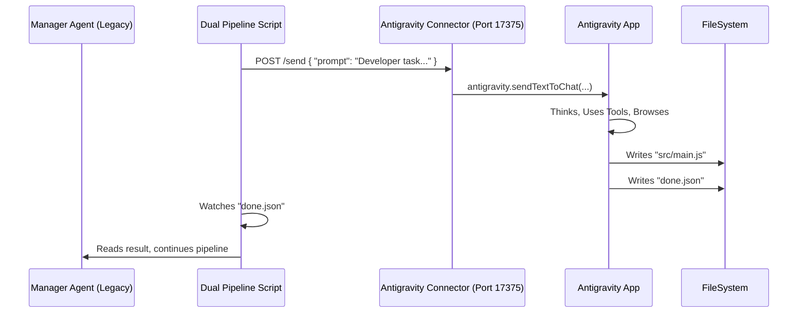

# Analysis and Plan - Antigravity POC (Updated)

## Context
Goal: Integrate Antigravity as a local agent in the "Local Codex" dual pipeline system.
Constraint: Antigravity works via a VS Code extension, not a standalone binary we can shell out to directly.

## Architecture

### The Component: `antigravity-connector`
A custom VS Code extension that exposes a JSON server on localhost.
- **Role**: Bridge between HTTP requests and VS Code's internal API.
- **Command Injection**: Uses `antigravity.sendTextToChat` to drive the agent.

### The Connectivity Problem (Resolved)
**Issue**: Antigravity runs as a separate process from the standard VS Code instance. Installing the extension in VS Code does *not* give access to Antigravity's internal commands.
**Solution**:
1.  **Installation**: The extension must be installed in Antigravity's own extension directory: `~/.antigravity/extensions`.
2.  **Port Conflict**: Since VS Code and Antigravity might run simultaneously, defaults conflict.
    - VS Code Extension Port: `17374`
    - Antigravity Extension Port: `17375` (recommended default)

## Implementation Status

### 1. Connector Extension
- [x] Source code creating an HTTP server.
- [x] Exposes `/send` (POST) to inject prompts.
- [x] Exposes `/health` and `/diagnostics`.
- [x] Uses a non-colliding default port in Antigravity (17375) while keeping VS Code on 17374.

### 2. Driver Scripts (POC)
- [x] `test_connection.js`: Verifies access to `http://localhost:17375`.
- [x] `test_prompt.js`: Sends a "Hello" prompt.
- [x] `test_file_loop.js`:
    - Sends a calculation task.
    - Instructs Antigravity to write result to `response.txt`.
    - Polls for file creation to confirm task completion.
- [x] `test_browser.js` / `run_github_task.js`:
    - Tests browser control capabilities.

## Dual Pipeline Integration Strategy

With Antigravity on port 17375, the architecture is:

## Next Steps
1.  **Restart Antigravity**: To load the patched extension.
2.  **Final Verification**: Run `test_connection.js` on port 17375.

## Correctif complete par Codex (2026-02-08)

Ce que j'ai constate:
- Les scripts "POC" a la racine pointaient bien sur `17375`, mais le driver Node (`src/cli.js` + `src/connectorClient.js`) et le smoke test d'integration utilisaient encore `17374` par defaut, ce qui faisait facilement parler au mauvais connecteur (VS Code au lieu d'Antigravity).

Ce que j'ai fait:
- POC: bascule du port par defaut a `17375` dans `src/connectorClient.js` et `src/cli.js`.
- POC: `tests/integration/connector_smoke.js` verifie maintenant aussi qu'il existe des commandes `antigravity.*` (fail-fast si on tape sur le mauvais host).
- Connecteur: `Local_Agents/antigravity-connector/src/extension.ts` choisit un port par defaut non-collisant (17375 si `appName` contient "Antigravity", sinon 17374), et le fallback n'ouvre plus une nouvelle conversation.
- Packaging: regeneration de `Local_Agents/antigravity-connector/antigravity-connector-0.0.1.vsix` avec ces changements.
